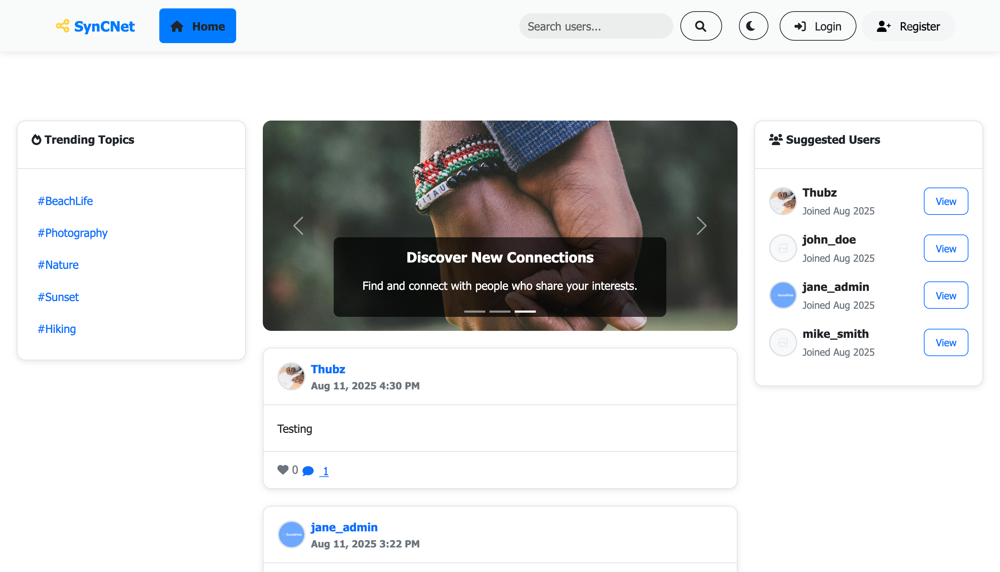

# SynCNet - Synced Community Network

A modern, responsive social media platform built with PHP, MySQL, and Bootstrap. Connect, share, and engage with friends through posts, comments, and likes. This project showcases a user-friendly interface, secure authentication, and real-time interactions for a seamless social experience, built for my Masters in Computer Science project, specifically for the Web Development course.



## 🚀 Features

- **User Authentication**: Secure registration and login system with password hashing
- **User Roles**: Two-tier user system (Regular users and Moderators)
- **Post Creation**: Share text posts with optional image uploads
- **Interactive Engagement**: Like and comment on posts in real-time
- **User Profiles**: Customizable profiles with bio and profile pictures
- **Search Functionality**: Find and connect with other users
- **Responsive Design**: Optimized for desktop, tablet, and mobile devices
- **Dark/Light Theme**: Toggle between themes with persistent preferences
- **Admin Panel**: Moderation tools for authorized users
- **Real-time Interactions**: AJAX-powered likes and comments without page refresh

## 🛠️ Tech Stack

### Backend
- **PHP 8.0+** - Server-side logic and API endpoints
- **MySQL 8.0+** - Relational database management
- **PDO** - Database connectivity with prepared statements

### Frontend
- **HTML5** - Semantic markup structure
- **CSS3** - Modern styling with custom properties
- **Bootstrap 5.3** - Responsive framework and components
- **JavaScript ES6+** - Interactive functionality and AJAX requests
- **Font Awesome 6.0** - Icon library

### Security
- **Password Hashing** - bcrypt algorithm for secure password storage
- **Input Validation** - Server-side sanitization and validation
- **SQL Injection Prevention** - Prepared statements throughout
- **File Upload Security** - Type and size validation with secure naming

## 📋 Prerequisites

### Option 1: Local Development Environment (Recommended for Beginners)

**MAMP (Mac & Windows)**
- Download from [https://www.mamp.info/](https://www.mamp.info/)
- Includes PHP, Apache, and MySQL in one package
- Easy graphical interface for managing services

**XAMPP (Cross-platform)**
- Download from [https://www.apachefriends.org/](https://www.apachefriends.org/)
- Available for Windows, macOS, and Linux
- Includes PHP, Apache, MySQL, and phpMyAdmin

**WAMP (Windows)**
- Download from [http://www.wampserver.com/](http://www.wampserver.com/)
- Windows-specific Apache, MySQL, PHP stack
- User-friendly interface for Windows users

**LAMP (Linux)**
- Install via package manager:
  ```bash
  # Ubuntu/Debian
  sudo apt update
  sudo apt install apache2 mysql-server php libapache2-mod-php php-mysql php-gd
  
  # CentOS/RHEL
  sudo yum install httpd mysql-server php php-mysql php-gd
  ```

### Option 2: Manual Installation

If you prefer to install components separately:

- **PHP 8.0 or higher** with the following extensions:
    - PDO
    - pdo_mysql
    - GD (for image processing)
    - fileinfo
- **MySQL 5.7 or higher** (or MariaDB 10.3+)
- **Web server** (Apache, Nginx, or PHP built-in server for development)
- **Composer** (optional, for dependency management)

## 🚀 Installation

### Step 0: Set Up Local Development Environment (If Needed)

#### Using MAMP

1. **Download and Install MAMP**
    - Visit [https://www.mamp.info/](https://www.mamp.info/)
    - Download the free version for your operating system
    - Follow the installation wizard

2. **Start MAMP Services**
    - Open MAMP application
    - Click "Start Servers" to start Apache and MySQL
    - Note the ports (usually Apache: 8888, MySQL: 8889)

3. **Access Web Directory**
    - MAMP web root is typically `/Applications/MAMP/htdocs/` (Mac) or `C:\MAMP\htdocs\` (Windows)
    - You'll clone the project here in Step 1

4. **Access phpMyAdmin**
    - Open browser and go to `http://localhost:8888/phpMyAdmin/`
    - Default credentials: Username: `root`, Password: `root`

#### Using XAMPP

1. **Download and Install XAMPP**
    - Visit [https://www.apachefriends.org/](https://www.apachefriends.org/)
    - Download for your operating system
    - Run the installer with default settings

2. **Start Services**
    - Open XAMPP Control Panel
    - Start "Apache" and "MySQL" services
    - Services typically run on Apache: 80, MySQL: 3306

3. **Access Web Directory**
    - XAMPP web root is `C:\xampp\htdocs\` (Windows) or `/opt/lampp/htdocs/` (Linux)
    - Clone the project here in Step 1

4. **Access phpMyAdmin**
    - Go to `http://localhost/phpmyadmin/`
    - Default credentials: Username: `root`, Password: (empty)

### Step 1: Clone the Repository

```bash
# For MAMP users
cd /Applications/MAMP/htdocs/          # Mac
cd C:\MAMP\htdocs\                     # Windows

# For XAMPP users  
cd C:\xampp\htdocs\                    # Windows
cd /opt/lampp/htdocs/                  # Linux

# Clone the repository
git clone https://github.com/thubamamba/SynCNet-MSc-Assignment.git
cd syncnet
```

### Step 2: Environment Configuration

Create a `.env` file in the root directory by copying the example:

```bash
cp .env.example .env
```

Edit the `.env` file with your database credentials:

**For MAMP users:**
```env
# Application Environment
APP_ENV=development

# Database Configuration (MAMP default ports)
DB_HOST=localhost:8889
DB_NAME=social_media_db
DB_USER=root
DB_PASS=root
```

**For XAMPP users:**
```env
# Application Environment
APP_ENV=development

# Database Configuration (XAMPP default ports)
DB_HOST=localhost:3306
DB_NAME=social_media_db
DB_USER=root
DB_PASS=
```

**For custom installations:**
```env
# Application Environment
APP_ENV=development

# Database Configuration
DB_HOST=localhost:3306
DB_NAME=social_media_db
DB_USER=your_username
DB_PASS=your_password
```

### Step 3: Database Setup

#### Option A: Using phpMyAdmin (MAMP/XAMPP Users)

1. **Access phpMyAdmin**
    - MAMP: Open `http://localhost:8888/phpMyAdmin/`
    - XAMPP: Open `http://localhost/phpmyadmin/`

2. **Create Database**
    - Click "Databases" tab
    - Enter database name: `social_media_db`
    - Click "Create"

3. **Import Schema**
    - Select your newly created database
    - Click "Import" tab
    - Choose the `database.sql` file from your project
    - Click "Go" to import

#### Option B: Using MySQL Command Line

```bash
# For MAMP users (adjust port as needed)
mysql -u root -p -P 8889 -h localhost

# For XAMPP users
mysql -u root -p

# Create the database
CREATE DATABASE social_media_db;

# Use the database
USE social_media_db;

# Import the schema
SOURCE /path/to/your/project/database.sql;
```

#### Option C: Using MySQL Workbench or Other GUI Tools

1. Connect to your MySQL server using appropriate credentials
2. Create a new database named `social_media_db`
3. Import the `database.sql` file

### 4. Directory Permissions

Ensure the uploads directory is writable:

```bash
chmod 755 assets/uploads/
```

### Step 5: Access Your Application

#### Using MAMP
- Open your browser and navigate to: `http://localhost:8888/syncnet/`
- If you changed the Apache port in MAMP, use that port instead

#### Using XAMPP
- Open your browser and navigate to: `http://localhost/syncnet/`
- If you're using a different port, adjust accordingly

#### Using PHP Built-in Server (Development)
```bash
# Navigate to your project directory
cd /path/to/syncnet

# Start the built-in server
php -S localhost:8000

# Access via: http://localhost:8000
```

## 🎯 Usage

### First Time Setup

1. **Access the Application**: Navigate to your configured URL
2. **Register an Account**:
    - Click "Register"
    - Choose account type (Regular User or Moderator)
    - Complete the registration form
3. **Login**: Use your credentials to access the platform
4. **Explore**: Start creating posts, following users, and engaging with content

### Account Types

#### Regular User (Level 1)
- Create and view posts
- Like and comment on posts
- Edit personal profile
- Search for other users

#### Moderator (Level 2)
- All Regular User capabilities
- Delete any posts and comments
- Access to admin panel
- Content moderation tools

### Sample Users

The database includes sample users for testing:

```
Username: john_doe
Password: password
Level: Regular User

Username: jane_admin  
Password: password
Level: Moderator
```

## 📁 Project Structure

```
SynCNet/
├── api/                    # API endpoints for AJAX operations
│   ├── add_comment.php
│   ├── delete_comment.php
│   ├── delete_post.php
│   ├── search_users.php
│   └── toggle_like.php
├── assets/
│   ├── css/
│   │   └── style.css       # Custom styling and theme management
│   ├── images/             # Static images and logos
│   ├── js/
│   │   └── main.js         # Interactive functionality
│   └── uploads/            # User-uploaded content (ensure writable)
├── config/
│   └── config.php          # Database configuration and core functions
├── includes/
│   ├── header.php          # Reusable header component
│   └── footer.php          # Reusable footer component
├── helpers/
│   └── api_helpers.php     # Utility functions
├── .env.example            # Environment variables template
├── admin.php               # Administrative interface
├── create_post.php         # Post creation handler
├── database.sql            # Database schema and sample data
├── index.php               # Main homepage and login
├── profile.php             # User profiles and personal posts
├── register.php            # User registration
└── update_profile.php      # Profile update handler
```

## 🔧 Configuration

### Environment Variables

| Variable | Description | Default |
|----------|-------------|---------|
| `APP_ENV` | Application environment | `production` |
| `DB_HOST` | Database host with optional port | `localhost:3306` |
| `DB_NAME` | Database name | `social_media_db` |
| `DB_USER` | Database username | `root` |
| `DB_PASS` | Database password | `root` |

### File Upload Limits

- **Post Images**: Maximum 5MB
- **Profile Pictures**: Maximum 2MB
- **Supported Formats**: JPEG, PNG, GIF, WebP

## 🚨 Troubleshooting

### Common Issues

#### "Connection failed" Error
- **MAMP/XAMPP**: Ensure both Apache and MySQL services are running in the control panel
- **Port Issues**: Verify the correct port in your `.env` file (MAMP usually uses 8889, XAMPP uses 3306)
- **Credentials**: Check username/password in `.env` match your setup
- **Database Exists**: Ensure `social_media_db` database was created successfully

#### Page Not Found (404 Error)
- **MAMP**: Ensure you're accessing `http://localhost:8888/syncnet/` (note the port)
- **XAMPP**: Ensure you're accessing `http://localhost/syncnet/`
- **Project Location**: Verify the project is in the correct `htdocs` directory
- **Case Sensitivity**: On Linux/Mac, ensure folder names match exactly

#### Apache Won't Start (XAMPP/MAMP)
- **Port Conflicts**: Another service might be using port 80/8080
    - Change Apache port in XAMPP/MAMP settings
    - Or stop conflicting services (Skype, IIS, etc.)
- **Permission Issues**: Run XAMPP as administrator (Windows) or with sudo (Linux)

#### MySQL Won't Start
- **Port Conflicts**: Another MySQL instance might be running
- **MAMP**: Try stopping any system MySQL service first
- **XAMPP**: Check if MySQL is already installed system-wide

#### File Upload Errors
- Check directory permissions on `assets/uploads/`
  ```bash
  chmod 755 assets/uploads/    # Linux/Mac
  ```
- Verify PHP upload settings in `php.ini`:
  ```ini
  upload_max_filesize = 10M
  post_max_size = 10M
  ```
- **MAMP/XAMPP**: php.ini location is shown in phpinfo() or MAMP/XAMPP control panel

#### Images Not Displaying
- Ensure GD extension is installed:
  ```bash
  php -m | grep -i gd
  ```
- **MAMP/XAMPP**: GD is usually included by default
- Check file permissions in uploads directory
- Verify image paths in browser developer tools

#### Theme Not Switching
- Clear browser cache and cookies
- Check JavaScript console for errors (F12 in most browsers)
- Ensure JavaScript is enabled in browser

#### "Forbidden" Error
- **MAMP/XAMPP**: Check that `htdocs` folder has proper permissions
- **Apache**: Ensure directory directive allows access in virtual host config
- **File Permissions**: Ensure PHP files are readable by web server

#### phpMyAdmin Access Issues
- **MAMP**: Default URL is `http://localhost:8888/phpMyAdmin/`
- **XAMPP**: Default URL is `http://localhost/phpmyadmin/`
- **Credentials**:
    - MAMP: username `root`, password `root`
    - XAMPP: username `root`, password empty (or `root`)

### Getting Help

If you encounter issues not covered here:

1. **Check Service Status**: Ensure Apache and MySQL are running in MAMP/XAMPP
2. **Check Error Logs**:
    - MAMP: `/Applications/MAMP/logs/` (Mac) or `C:\MAMP\logs\` (Windows)
    - XAMPP: `xampp\apache\logs\error.log` and `xampp\mysql\data\*.err`
3. **PHP Errors**: Enable error reporting by setting `APP_ENV=development` in `.env`
4. **Browser Console**: Check for JavaScript errors (F12 → Console tab)

## 🤝 Contributing

1. Fork the repository
2. Create a feature branch (`git checkout -b feature/amazing-feature`)
3. Commit your changes (`git commit -m 'Add amazing feature'`)
4. Push to the branch (`git push origin feature/amazing-feature`)
5. Open a Pull Request

## 📝 License

This project is licensed under the MIT License - see the [LICENSE](LICENSE) file for details.

## 🙏 Acknowledgments

- Bootstrap team for the responsive framework
- Font Awesome for the icon library
- PHP community for excellent documentation

## 📞 Support

If you encounter any issues or have questions:

1. Check the [troubleshooting section](#-troubleshooting)
2. Search existing [issues](https://github.com/yourusername/syncnet/issues)
3. Create a new issue with detailed information

---

**Happy coding!** 🎉